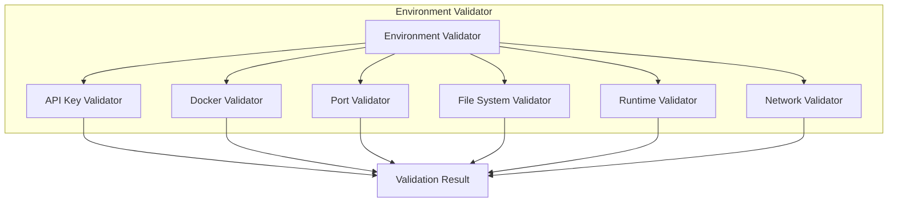
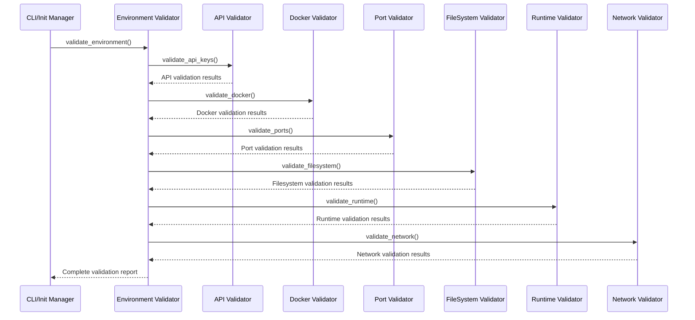

# Environment Validation Module

## Overview
The Environment Validation Module ensures all prerequisites are met before system initialization, preventing startup failures and providing clear error messages.

## Architecture



## Validation Components

### 1. API Key Validator
```python
class APIKeyValidator:
    def validate_gemini_key(self, api_key: str) -> ValidationResult:
        """Validate Gemini API key format and connectivity"""
        
    def validate_langsmith_key(self, api_key: str) -> ValidationResult:
        """Validate optional LangSmith API key"""
        
    def test_api_connectivity(self, api_key: str) -> bool:
        """Test actual API connectivity with test request"""
```

**Validation Checks:**
- API key format validation (length, character set)
- API connectivity test with lightweight request
- Rate limit validation
- Error handling for invalid keys

### 2. Docker Validator
```python
class DockerValidator:
    def check_docker_installation(self) -> ValidationResult:
        """Verify Docker is installed and accessible"""
        
    def check_docker_compose(self) -> ValidationResult:
        """Verify Docker Compose is available"""
        
    def check_docker_permissions(self) -> ValidationResult:
        """Verify user has Docker permissions"""
```

**Validation Checks:**
- Docker daemon running status
- Docker Compose version compatibility
- User permissions for Docker operations
- Available Docker resources (memory, disk)

### 3. Port Validator
```python
class PortValidator:
    REQUIRED_PORTS = {
        8123: "LangGraph API",
        5433: "PostgreSQL", 
        5173: "Frontend Dev Server"
    }
    
    def check_port_availability(self, port: int) -> ValidationResult:
        """Check if port is available for binding"""
        
    def validate_all_ports(self) -> ValidationResult:
        """Validate all required ports are available"""
```

**Validation Checks:**
- Port availability testing
- Alternative port suggestions
- Port conflict resolution
- Firewall considerations

### 4. File System Validator
```python
class FileSystemValidator:
    REQUIRED_STRUCTURE = {
        "backend/": {"type": "directory"},
        "frontend/": {"type": "directory"},
        "docker-compose.yml": {"type": "file"},
        "backend/.env": {"type": "file", "optional": True}
    }
    
    def validate_directory_structure(self) -> ValidationResult:
        """Validate required directory structure exists"""
        
    def check_permissions(self) -> ValidationResult:
        """Check read/write permissions"""
```

**Validation Checks:**
- Required directory structure
- File permissions validation
- Disk space availability
- Path length limitations

### 5. Runtime Validator
```python
class RuntimeValidator:
    def check_python_version(self) -> ValidationResult:
        """Validate Python 3.11+ is available"""
        
    def check_node_version(self) -> ValidationResult:
        """Validate Node.js 18+ is available"""
        
    def check_dependencies(self) -> ValidationResult:
        """Validate core system dependencies"""
```

**Validation Checks:**
- Python version compatibility (3.11+)
- Node.js version compatibility (18+)
- System dependencies availability
- Virtual environment setup

### 6. Network Validator
```python
class NetworkValidator:
    def check_internet_connectivity(self) -> ValidationResult:
        """Test internet connectivity for API calls"""
        
    def check_dns_resolution(self) -> ValidationResult:
        """Validate DNS resolution works"""
        
    def validate_proxy_settings(self) -> ValidationResult:
        """Check corporate proxy configuration"""
```

**Validation Checks:**
- Internet connectivity test
- DNS resolution validation
- Proxy configuration detection
- SSL certificate validation

## Validation Flow



## Configuration Schema

```yaml
validation:
  api_keys:
    gemini:
      required: true
      format_regex: "^[A-Za-z0-9_-]{39}$"
      test_endpoint: "https://generativelanguage.googleapis.com/v1/models"
    langsmith:
      required: false
      format_regex: "^ls__[A-Za-z0-9_-]{32}$"
      
  docker:
    min_version: "20.10.0"
    compose_min_version: "2.0.0"
    required_resources:
      memory: "2GB"
      disk: "5GB"
      
  ports:
    api: 8123
    postgresql: 5433
    dev_server: 5173
    
  runtime:
    python:
      min_version: "3.11.0"
      required_packages: ["pip", "virtualenv"]
    nodejs:
      min_version: "18.0.0"
      required_packages: ["npm"]
      
  network:
    test_urls:
      - "https://www.google.com"
      - "https://generativelanguage.googleapis.com"
    timeout: 10
    retry_attempts: 3
```

## Error Handling

```python
class ValidationError(Exception):
    def __init__(self, component: str, message: str, suggestions: List[str] = None):
        self.component = component
        self.message = message
        self.suggestions = suggestions or []
        
class ValidationResult:
    def __init__(self, 
                 success: bool, 
                 component: str,
                 message: str = None,
                 suggestions: List[str] = None,
                 warnings: List[str] = None):
        self.success = success
        self.component = component
        self.message = message
        self.suggestions = suggestions or []
        self.warnings = warnings or []
```

## Error Messages with Solutions

### Missing API Key
```
❌ GEMINI_API_KEY not found in environment

🔧 To fix this issue:
1. Get your API key from https://makersuite.google.com/app/apikey
2. Create backend/.env file with: GEMINI_API_KEY=your_key_here
3. Restart the initialization process

📚 See setup guide: README.md#environment-setup
```

### Docker Not Available
```
❌ Docker is not running or accessible

🔧 To fix this issue:
1. Start Docker Desktop or Docker daemon
2. Verify with: docker --version
3. Ensure user is in docker group: sudo usermod -aG docker $USER
4. Restart terminal and try again

📚 See Docker installation: https://docs.docker.com/get-docker/
```

### Port Conflicts
```
❌ Port 8123 is already in use

🔧 To fix this issue:
1. Stop the process using port 8123: lsof -ti:8123 | xargs kill
2. Or configure alternative port in docker-compose.yml
3. Suggested alternative ports: 8124, 8125, 8126

📚 See port configuration: README.md#port-configuration
```

## Implementation Structure

```
init/
├── validators/
│   ├── __init__.py
│   ├── base.py              # Base validator class
│   ├── api_validator.py     # API key validation
│   ├── docker_validator.py  # Docker environment validation  
│   ├── port_validator.py    # Port availability validation
│   ├── fs_validator.py      # Filesystem validation
│   ├── runtime_validator.py # Runtime version validation
│   └── network_validator.py # Network connectivity validation
├── environment_validator.py # Main orchestrator
├── exceptions.py           # Custom exceptions
└── config.py              # Validation configuration
```

## Usage Example

```python
from init.environment_validator import EnvironmentValidator

def main():
    validator = EnvironmentValidator()
    results = validator.validate_all()
    
    if not results.all_passed:
        print("❌ Environment validation failed:")
        for result in results.failed_validations:
            print(f"   {result.component}: {result.message}")
            for suggestion in result.suggestions:
                print(f"      💡 {suggestion}")
        return False
        
    print("✅ Environment validation passed!")
    return True
```

## Testing Strategy

### Unit Tests
- Each validator component tested independently
- Mock external dependencies (API calls, file system)
- Test both success and failure scenarios
- Validate error messages and suggestions

### Integration Tests
- Test complete validation flow
- Test with actual Docker environment
- Validate network connectivity
- Test file system operations

### Performance Tests
- Validation should complete in < 10 seconds
- Parallel validation where possible
- Timeout handling for network operations
- Resource usage monitoring