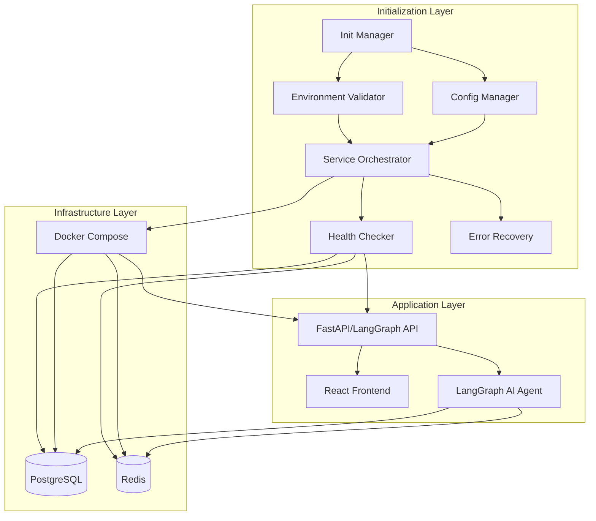
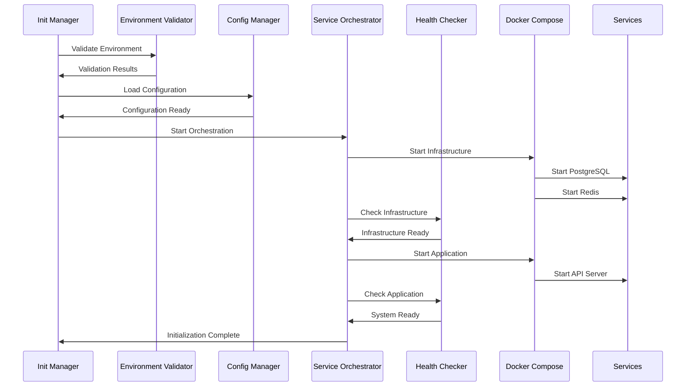
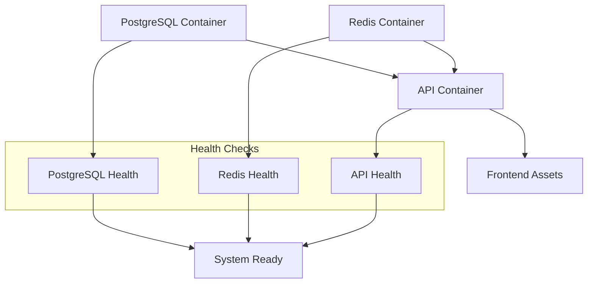
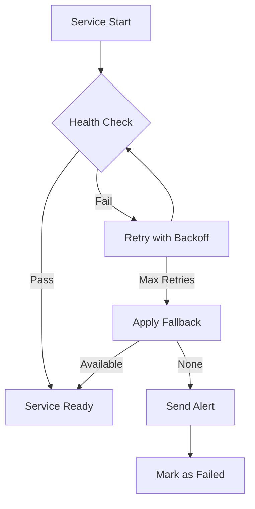
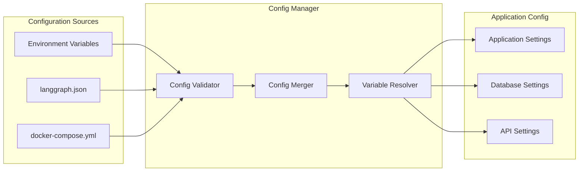

# Deep Search AI System - Initialization Architecture

## System Architecture Overview

## Core Components

### 1. Environment Validation Module
- **Purpose**: Validate all required environment variables and dependencies
- **Key Functions**:
  - API key validation (GEMINI_API_KEY, LANGSMITH_API_KEY)
  - Docker availability check
  - Port availability validation
  - Directory structure verification
  - Python/Node.js version checks

### 2. Service Orchestration Module
- **Purpose**: Manage service startup sequencing and dependencies
- **Key Functions**:
  - Container startup ordering
  - Dependency resolution
  - Service state management
  - Graceful shutdown handling
  - Resource allocation

### 3. Health Check System
- **Purpose**: Monitor service health and availability
- **Key Functions**:
  - PostgreSQL readiness checks
  - Redis connectivity validation
  - API endpoint health monitoring
  - Frontend asset availability
  - Continuous health monitoring

### 4. Error Recovery Mechanisms
- **Purpose**: Handle failures and implement recovery strategies
- **Key Functions**:
  - Retry logic with exponential backoff
  - Fallback configurations
  - Graceful degradation
  - Failure isolation
  - Recovery notifications

### 5. Configuration Management
- **Purpose**: Centralized configuration handling
- **Key Functions**:
  - Environment variable management
  - Configuration validation
  - Dynamic configuration updates
  - Security credential handling
  - Multi-environment support

## Startup Sequence

## Container Dependencies

## Error Recovery Flow

## Configuration Architecture

## Key Design Principles

### 1. Modular Architecture
- Each module has single responsibility
- Clear interfaces between components
- Pluggable architecture for different environments
- Independent module testing capability

### 2. Fault Tolerance
- No single point of failure
- Graceful degradation strategies
- Comprehensive error handling
- Recovery mechanisms at each layer

### 3. Observability
- Detailed logging at each step
- Health status reporting
- Performance metrics collection
- Error tracking and alerting

### 4. Security
- Environment variable validation
- Credential management
- Network isolation
- Secure defaults

### 5. Scalability
- Container orchestration ready
- Resource management
- Load balancing considerations
- Multi-instance support

## Performance Targets

- **Container Startup**: < 60 seconds
- **Health Check Response**: < 5 seconds
- **Configuration Loading**: < 10 seconds
- **Error Recovery**: < 30 seconds
- **Memory Footprint**: < 2GB total system

## Next Steps

1. Implement Environment Validation Module
2. Create Service Orchestration Module
3. Build Health Check System
4. Design Error Recovery Mechanisms
5. Develop Configuration Management
6. Integrate Docker Compose orchestration
7. Add robust failure handling
8. Create comprehensive testing suite